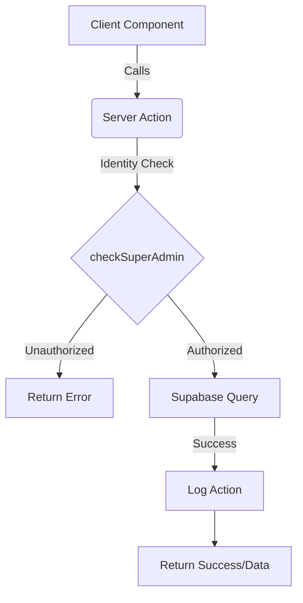

# Super Admin: Architecture & Design

The Super Admin module is built on a modern, serverless architecture that emphasizes strict security and multi-tenant isolation.

## Technical Stack

- **Framework**: [Next.js](https://nextjs.org/) (App Router)
- **Database**: [Supabase](https://supabase.com/) (PostgreSQL)
- **Security**: [Row Level Security (RLS)](https://www.postgresql.org/docs/current/ddl-rls.html)
- **Styling**: [Tailwind CSS](https://tailwindcss.com/) & [Radix UI](https://www.radix-ui.com/)
- **Icons**: [Lucide React](https://lucide.dev/)

## Multi-Tenant Isolation Design

The platform uses a **Zero Trust** Row Level Security (RLS) model. While standard users are restricted to their own `company_id`, the Super Admin role bypasses these filters to provide global visibility.

### RLS Policies

1.  **Tenant Filter**: Standard roles (`admin`, `sales_agent`, etc.) only see rows where `company_id` matches their profile.
2.  **Global Access**: Users with `role = 'superadmin'` in the `employees` table are granted access to all rows across all tables.
3.  **Auto-Assignment**: Database triggers automatically assign the correct `company_id` to new records based on the creator's identity.

## Backend Data Flow

Administrative operations are handled through **Next.js Server Actions** (`actions.ts`).

### Action Logic

- **Authentication**: Verified via `supabase.auth.getUser()`.
- **Authorization**: The `checkSuperAdmin()` utility inspects the `employees` table.
- **Audit Logging**: The `logAction()` utility records every change (Create, Update, Delete) into the `audit_logs` table.
