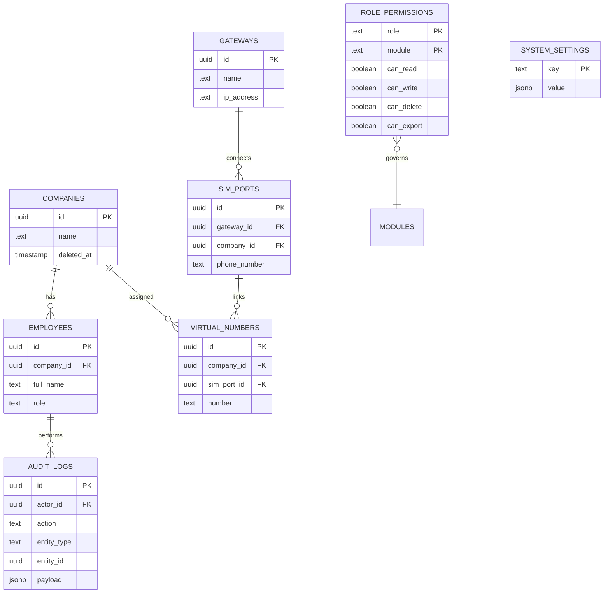

# Super Admin: Database Schema

The module manages several core tables for platform-wide data and infrastructure.

## Entity Relationship Diagram (ERD)

## Table Definitions

### `companies` (Tenants)
The core tenant table. `deleted_at` is used for soft-deletion and archiving.

### `employees` (Users)
Users of the platform. The `role` column (`superadmin`, `admin`, `sales_agent`, `call_center_agent`, `technician`) determines permissions.

### `audit_logs`
A global immutable table for tracking administrative changes.

### `gateways` & `sim_ports`
Telephony infrastructure components. `sim_ports` are mapped to specific companies.

### `virtual_numbers`
The public-facing numbers assigned to tenants.

### `role_permissions`
Cross-tenant RBAC configuration. Defines which roles can access which modules.

### `system_settings`
Global configuration key-value pairs (e.g., `maintenance_mode`, `support_email`).
