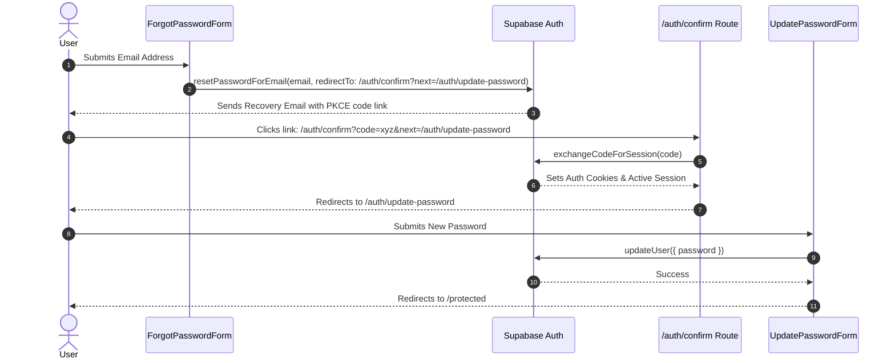

# Password Reset Routine & Developer Sidebar Architecture

This document details the architectural fixes and enhancements applied to the **Password Reset Routine** and the **Developer Role Sidebar Navigation**.

---

## 1. Overview & Objectives

1. **Working Password Reset Routine**: Enable users to request a password reset email, click the recovery link, automatically exchange auth codes for an active session, and set a new password without encountering `"Auth session missing"` or routing errors.
2. **Developer Role Sidebar Alignment**: Ensure users with the `dev` role (`hanspajero2@gmail.com`) receive a fully populated sidebar menu containing their authorized workspace routes (`Portal Home`, `Dev Workspace`, `Tasks`, `Chat Inbox`, `Support`).

---

## 2. Password Reset Flow: What Happened & Why

### The Root Cause

Previously, attempting a password reset would fail due to three compounding issues in the PKCE authentication flow:

1. **Direct Link Bypass**: `components/forgot-password-form.tsx` set `redirectTo` to `${window.location.origin}/auth/update-password`. When the user opened the recovery link in their email, Supabase appended a PKCE authorization parameter (`?code=...` or `?token_hash=...`).
2. **Bypassed Code Exchange**: Because the link landed directly on the client-side `/auth/update-password` page instead of passing through an auth route handler, the authorization `code` was never exchanged for a server session. When the client called `supabase.auth.updateUser({ password })`, Supabase rejected the request because no active user session existed.
3. **Incomplete Auth Route Handler**: `/app/auth/confirm/route.ts` only checked for `token_hash` & `type`. When Supabase PKCE sent a `code` parameter, `confirm/route.ts` returned an error: `"No token hash or type"`.

---

### The Fix Implemented

#### Files Modified & Exact Changes

1. **[components/forgot-password-form.tsx](file:///c:/Users/mbugu/Desktop/Code/React/crm-clone/components/forgot-password-form.tsx)**
   - **Change**: Updated `resetPasswordForEmail` `redirectTo` option.
   - **Reason**: Routes the recovery link through `/auth/confirm?next=/auth/update-password` so server-side PKCE code exchange can execute.

2. **[app/auth/confirm/route.ts](file:///c:/Users/mbugu/Desktop/Code/React/crm-clone/app/auth/confirm/route.ts)**
   - **Change**: Added support for PKCE `code` handling via `supabase.auth.exchangeCodeForSession(code)`.
   - **Reason**: Converts the single-use PKCE `code` into an authenticated session stored in browser cookies before forwarding to `/auth/update-password`.

3. **[components/update-password-form.tsx](file:///c:/Users/mbugu/Desktop/Code/React/crm-clone/components/update-password-form.tsx)**
   - **Change**: Added a **Confirm Password** input field, a 6-character minimum length check, password mismatch validation, and an automatic 2-second success redirect banner to `/protected`.
   - **Reason**: Prevents user entry typos, enforces password security rules, and provides feedback upon completion.

---

## 3. Developer Role Sidebar Navigation: What Happened & Why

### The Issue
Users assigned the `dev` role (`hanspajero2@gmail.com`) experienced missing navigation items in the sidebar.

### The Fix Implemented
1. **[components/common/DashboardShell.tsx](file:///c:/Users/mbugu/Desktop/Code/React/crm-clone/components/common/DashboardShell.tsx)**: Added `"dev"` to the `roles` array for `/protected/tickets` (Support) and ensured `navItems` filters properly for `"dev"`.
2. **[components/layout/sidebar.tsx](file:///c:/Users/mbugu/Desktop/Code/React/crm-clone/components/layout/sidebar.tsx)**: Aligned `sidebarItems` roles array to include `"dev"` for `/protected/tickets`.

Now, logging in as a Developer (`dev` role) renders the complete authorized navigation:
- **Dashboard / Portal Home** (`/protected`)
- **Dev Workspace** (`/protected/dev`)
- **Tasks** (`/protected/task-management-board`)
- **Chat Inbox** (`/protected/omnichannel-chat-inbox`)
- **Support** (`/protected/tickets`)

---

## 4. Demo Account Mapping Summary

All demo user accounts are configured in the `employees` database table under company `16c037ab-aa7d-4277-b0e3-0bee215cb935` (*Cloudora Testing INC*):

| Email Address | Role | Display Name | Workspace |
|---|---|---|---|
| `mbuguavictor1@gmail.com` | `superadmin` | Victor Superadmin | Global Command & System Audit Logs |
| `mbuguavictor46@gmail.com` | `admin` | Victor Admin | Executive Dashboard & Tenant Administration |
| `amison011@gmail.com` | `sales_agent` | Amison Sales | My Workspace & CRM Leads |
| `hanspajero2@gmail.com` | `dev` | Hans Dev | Dev Workspace & Engineering Stream |

---

## 5. Verification

- **Database Verification**: All 4 employee records verified in Postgres.
- **Typecheck Validation**: Executed `npx tsc --noEmit` with **0 errors**.
