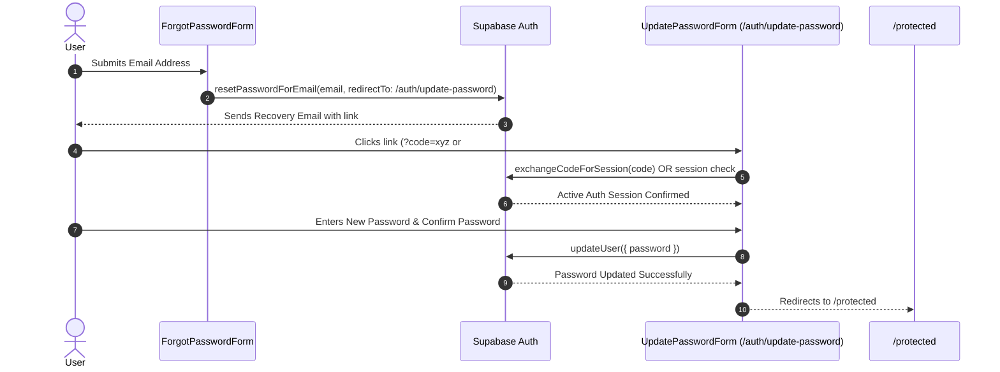

# Password Reset Routine & Developer Sidebar Architecture

This document details the architectural fixes, configuration requirements, and troubleshooting applied to the **Password Reset Routine** and the **Developer Role Sidebar Navigation**.

---

## 1. Overview & Objectives

1. **Working Password Reset Routine**: Enable users to request a password reset email, click the recovery link, automatically exchange auth codes/hashes for an active session, and set a new password without encountering `"Auth session missing"`, `"otp_expired"`, or routing errors.
2. **Developer Role Sidebar Alignment**: Ensure users with the `dev` role (`hanspajero2@gmail.com`) receive a fully populated sidebar menu containing their authorized workspace routes (`Portal Home`, `Dev Workspace`, `Tasks`, `Chat Inbox`, `Support`).

---

## 2. Password Reset Flow: Technical Diagnosis & Fixes

### 2.1 The Root Cause Analysis

When a user clicks a password reset link and lands on `http://localhost:3000/?error=access_denied&error_code=otp_expired...`, this happens due to three factors:

1. **Supabase Redirect URL Whitelist (Dashboard Configuration)**:
   - Supabase validates `redirectTo` against allowed URL patterns configured in **Supabase Dashboard > Auth > URL Configuration > Redirect URLs**.
   - If `http://localhost:3000/auth/update-password` (or `http://localhost:3000/auth/confirm`) is **not** in the Redirect URLs whitelist, Supabase rejects the custom redirect URL and falls back to Site URL (`http://localhost:3000/`) with `error=access_denied&error_code=otp_expired`.
2. **Single-Use OTP Token Consumption**:
   - Supabase recovery tokens are single-use. If multiple reset requests are sent in quick succession, only the **latest** email link is valid. Clicking an older email link returns `otp_expired`.
   - Automatic email scanners or link pre-fetchers can also consume the token upon delivery.
3. **Missing Code Exchange & Hash Parameter Handlers**:
   - When using PKCE (`code`) or Implicit (`#access_token`), if the landing page does not perform code exchange or session checking on mount, calling `updateUser({ password })` fails with `"Auth session missing"`.

---

### 2.2 Supabase Dashboard Configuration (VITAL)

To ensure Supabase Auth redirects password reset links correctly in development and production, verify the following settings in your **Supabase Dashboard**:

1. Go to **Authentication > URL Configuration**.
2. Set **Site URL**: `http://localhost:3000` (or your Vercel deployment URL e.g. `https://your-app.vercel.app`).
3. In **Redirect URLs**, add all environment domains:
   - `http://localhost:3000/auth/update-password`
   - `http://localhost:3000/**`
   - `https://*.vercel.app/**` (Wildcard for all Vercel preview & production deployments)
   - `https://your-vercel-domain.vercel.app/auth/update-password`
   - `https://your-custom-domain.com/**`

---

### 2.3 System Architecture & Code Fixes

#### Files Modified & Implementation Details

1. **[components/update-password-form.tsx](file:///c:/Users/mbugu/Desktop/Code/React/crm-clone/components/update-password-form.tsx)**
   - **PKCE & Session Initialization**: On mount, extracts `code` or URL/Hash parameters. Exchanges `code` for a session via `exchangeCodeForSession(code)`.
   - **Expired Token Card**: If `error_code=otp_expired` or invalid link is detected, renders a clear **"Link Expired or Invalid"** card with a direct button back to `/auth/forgot-password`.
   - **Validation & Feedback**: Includes a **Confirm Password** field, 6-character length validation, mismatch error handling, and a 2-second success redirect banner to `/protected`.

2. **[components/forgot-password-form.tsx](file:///c:/Users/mbugu/Desktop/Code/React/crm-clone/components/forgot-password-form.tsx)**
   - **Direct `redirectTo`**: Configured `redirectTo: ${window.location.origin}/auth/update-password`.
   - **Expired Link Warning Banner**: If redirected back with `?error_code=otp_expired`, renders an amber notification instructing the user to request a fresh link.

3. **[components/auth/AuthErrorRedirect.tsx](file:///c:/Users/mbugu/Desktop/Code/React/crm-clone/components/auth/AuthErrorRedirect.tsx)** & **[app/page.tsx](file:///c:/Users/mbugu/Desktop/Code/React/crm-clone/app/page.tsx)**
   - **Root Fallback Handler**: Catches any root-level Supabase redirects (`http://localhost:3000/?error=access_denied&error_code=otp_expired`) and forwards the user directly to `/auth/forgot-password?error_code=otp_expired`.

---

## 3. Developer Role Sidebar Navigation: What Happened & Why

### The Issue
Users assigned the `dev` role (`hanspajero2@gmail.com`) experienced missing navigation items in the sidebar.

### The Fix Implemented
1. **[components/common/DashboardShell.tsx](file:///c:/Users/mbugu/Desktop/Code/React/crm-clone/components/common/DashboardShell.tsx)**: Added `"dev"` to the `roles` array for `/protected/tickets` (Support) and ensured `navItems` filters properly for `"dev"`.
2. **[components/layout/sidebar.tsx](file:///c:/Users/mbugu/Desktop/Code/React/crm-clone/components/layout/sidebar.tsx)**: Aligned `sidebarItems` roles array to include `"dev"` for `/protected/tickets`.

Now, logging in as a Developer (`dev` role) renders the complete authorized navigation:
- **Dashboard / Portal Home** (`/protected`)
- **Dev Workspace** (`/protected/dev`)
- **Tasks** (`/protected/task-management-board`)
- **Chat Inbox** (`/protected/omnichannel-chat-inbox`)
- **Support** (`/protected/tickets`)

---

## 4. Demo Account Mapping Summary

All demo user accounts are configured in the `employees` database table under company `16c037ab-aa7d-4277-b0e3-0bee215cb935` (*Cloudora Testing INC*):

| Email Address | Role | Display Name | Workspace |
|---|---|---|---|
| `mbuguavictor1@gmail.com` | `superadmin` | Victor Superadmin | Global Command & System Audit Logs |
| `mbuguavictor46@gmail.com` | `admin` | Victor Admin | Executive Dashboard & Tenant Administration |
| `amison011@gmail.com` | `sales_agent` | Amison Sales | My Workspace & CRM Leads |
| `hanspajero2@gmail.com` | `dev` | Hans Dev | Dev Workspace & Engineering Stream |

---

## 5. Verification

- **Database Verification**: All 4 employee records verified in Postgres.
- **Typecheck Validation**: Executed `npx tsc --noEmit` with **0 errors**.
