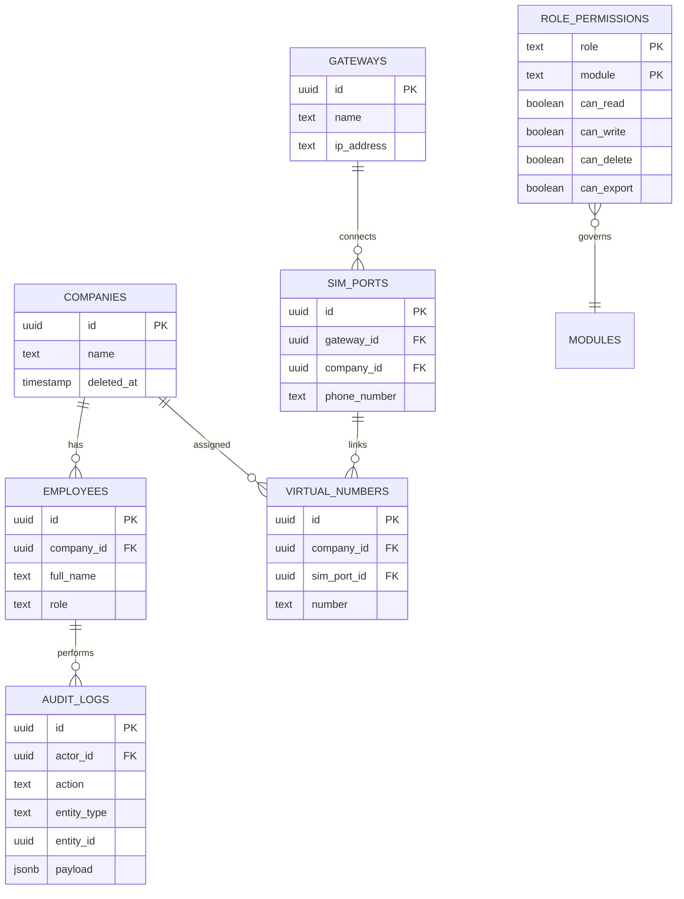

# Developer Guide: CRM Clone Codebase

Welcome to the CRM Clone project! This guide provides a detailed technical overview to help you navigate, understand, contribute to, and deploy the codebase.

## 1. Architecture Overview
This platform is a **multi-tenant SaaS CRM** built on the **Next.js App Router** and powered by **Supabase**. It uses server-side rendering (SSR) and Server Actions for data mutation, ensuring a secure and fast experience.

### Tech Stack
- **Framework:** Next.js 15 (App Router, Turbopack)
- **Language:** TypeScript (React 19)
- **Styling:** Tailwind CSS v3 + shadcn/ui
- **Backend & Database:** Supabase (PostgreSQL, Auth, RLS)
- **Email:** Resend API
- **State/Data Fetching:** Next.js Server Actions + SWR (client-side)

---

## 2. Running Locally & Deployment Commands

### Prerequisites
- Node.js (v20+)
- Supabase CLI (for local database development)

### Running Locally
1. Install dependencies:
   ```bash
   npm install
   ```
2. Setup Environment Variables in `.env.local`:
   ```env
   NEXT_PUBLIC_SUPABASE_URL=your-project-url
   NEXT_PUBLIC_SUPABASE_ANON_KEY=your-anon-key
   RESEND_API_KEY=your-resend-key
   ```
3. Start the Next.js development server:
   ```bash
   npm run dev
   ```

### Supabase Database Management
1. Start Supabase locally (optional, if you aren't using a cloud project):
   ```bash
   supabase start
   ```
2. Apply database migrations to a new environment:
   ```bash
   supabase db push
   ```
3. Re-generate TypeScript definitions after schema changes:
   ```bash
   supabase gen types typescript --project-id "your-project-id" > types/supabase.ts
   ```

### Testing
Run the automated test suite (including RLS verification tests):
```bash
npx vitest
```
Specifically, to verify Super Admin RLS isolation:
```bash
npx vitest app/protected/super-admin/tests/rls-test.ts
```

---

## 3. Project Structure
The codebase follows a modular structure separated by features and responsibilities:

```text
crm-clone/
├── app/
│   ├── actions/         # Server Actions (database mutations)
│   ├── api/             # Next.js Route Handlers (webhooks, external integrations)
│   ├── auth/            # Auth callbacks (e.g., PKCE confirm, update-password)
│   ├── protected/       # Authenticated app routes (gated by session & role)
│   └── ui/              # Shared Dashboard UI fragments
├── components/
│   ├── admins/          # Admin/Superadmin management UI
│   ├── auth/            # Login, Signup, Reset Password forms
│   ├── common/          # Modals, layout shells, generic UI
│   ├── crm/             # Leads table, Task board client wrappers
│   ├── layout/          # Sidebar, header, navigation matrix
│   └── ui/              # shadcn base components (buttons, inputs)
├── docs/                # Project documentation and guides
├── lib/
│   ├── supabase/        # Supabase client singletons (server/client/middleware)
│   ├── email/           # Resend email helpers
│   └── utils/           # Helper functions (date formatting, etc.)
├── supabase/
│   └── migrations/      # PostgreSQL schema, triggers, and RLS policies
└── types/               # Global TypeScript definitions (supabase.ts)
```

---

## 4. Authentication & Security

### Supabase SSR Auth
We use `@supabase/ssr` to maintain sessions via cookies. This allows us to securely access user sessions in Server Components, Server Actions, and Middleware.
- **Middleware (`middleware.ts`):** Protects routes, refreshes expired tokens, and enforces basic session existence for `/protected/*`.
- **PKCE Password Reset:** Uses the `auth/confirm` route handler to exchange an OTP for a session, and redirects to the update password form.

### Zero Trust Tenant Isolation
The platform enforces data isolation for all non-superadmin roles using **PostgreSQL Row Level Security (RLS)**.
- **Isolation**: Standard tenants cannot `SELECT` or `DML` any row not belonging to their `company_id`.
- **Triggers**: Database-level triggers prevent manual `company_id` spoofing by overwriting any provided `company_id` with the authenticated user's actual `company_id`.

---

## 5. Role-Based Access Control (RBAC) & Multi-Tenancy

The CRM enforces strict tenant isolation and role permissions at **two layers**: the UI/Router layer and the Database RLS layer.

### The 7 Roles
1. `superadmin` - Platform-wide global access.
2. `admin` - Tenant-scoped company administrator.
3. `sales_agent` - Standard CRM user (leads, tasks).
4. `server_admin` - Infrastructure and support ticket resolver.
5. `dev` - Developer/engineering workspace access.
6. `client` / `customer` - End-users filing support tickets.
7. `unassigned` - Default state pending org assignment.

### Verifying Super Admin Identity
Server Actions targeting superadmin capabilities must verify the identity explicitly via the `employees` table:
```typescript
export async function checkSuperAdmin(supabase: any) {
  const { data: { user } } = await supabase.auth.getUser();
  if (!user) return false;
  
  const { data: profile } = await supabase
    .from("employees")
    .select("role")
    .eq("id", user.id)
    .single();

  return profile?.role === "superadmin";
}
```

---

## 6. Super Admin Module Database Schema (ERD)

The superadmin layer manages platform-wide data and infrastructure. 



### Immutable Audit Logging
Every change made through a Super Admin Server Action is recorded in the `audit_logs` table (e.g., `actor_id`, `action`, `payload`).

---

## 7. Working on the Super Admin Pages (WIP)
The `superadmin` role pages (located at `app/protected/super-admin/*`) are actively under development. 
- The Global Command dashboard aggregates cross-tenant data.
- Ensure that any queries run on behalf of the `superadmin` role account for multi-tenancy (e.g., passing explicit `company_id` filters if drilling down into a specific tenant).
- **Development Seed:** Run `app/protected/super-admin/scripts/seed-superadmin.sql` in the Supabase SQL Editor to initialize a dev superadmin user.
