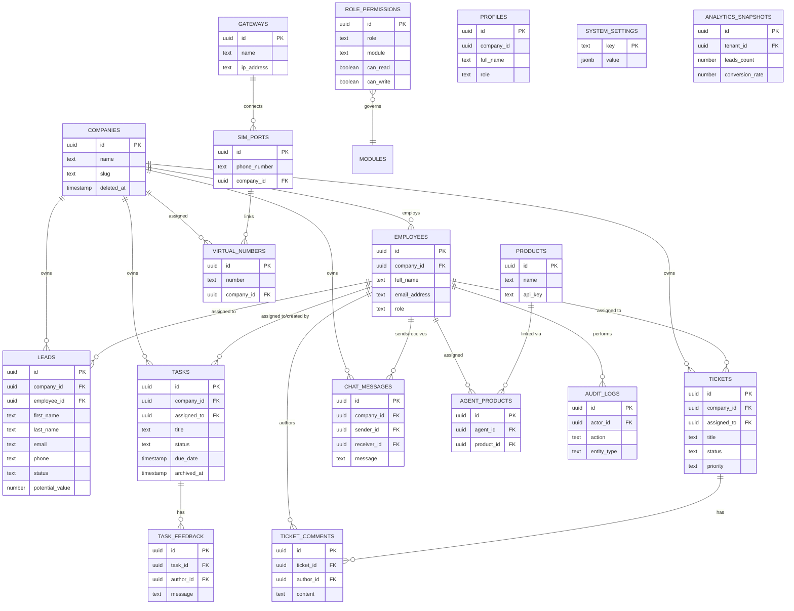

# CRM Platform Database Schema

This document outlines the complete PostgreSQL database schema for the CRM platform, powered by Supabase.

## Complete Entity Relationship Diagram (ERD)

## Table Definitions & Purpose

### 1. Tenancy & Authorization
- **`companies`**: The core tenant table. Every record in the system belongs to a company to enforce strict Row-Level Security (RLS) isolation.
- **`employees`**: Maps Supabase Auth UUIDs to a specific `company_id` and assigns a `role` (`superadmin`, `admin`, `sales_agent`, `server_admin`, `dev`, `client`, `unassigned`).
- **`profiles`**: Public-facing read-only profile data mirroring employee state.

### 2. CRM & Sales
- **`leads`**: Customer Relationship pipeline records. Tracks contact info, assigned agent, status, and potential deal value.
- **`products` & `agent_products`**: Product catalog and the junction table mapping sales agents to the products they are authorized to sell/support.

### 3. Task Management
- **`tasks`**: Internal objectives and SLA tasks with due dates, assignees, and a complex 3-phase archiving lifecycle (`archived_at`, `unarchive_used`).
- **`task_feedback`**: Comments and updates left on specific tasks.

### 4. Support & Incidents
- **`tickets`**: Internal or customer-facing incident reports with status and priority tracking.
- **`ticket_comments`**: Audit trail of communication and resolution updates on a ticket.

### 5. Communication
- **`chat_messages`**: Real-time omnichannel chat messages tied to a specific company workspace.

### 6. Platform Infrastructure & Global (Super Admin)
- **`audit_logs`**: Immutable ledger of all destructive or sensitive administrative actions.
- **`role_permissions`**: Matrix configuration that defines cross-tenant RBAC permissions for various modules.
- **`system_settings`**: Global key-value store for platform configurations (e.g., maintenance mode).
- **`analytics_snapshots`**: Time-series snapshots of tenant performance (lead count, task completion rates) for the Executive Dashboard.
- **`gateways`, `sim_ports`, `virtual_numbers`**: Telephony infrastructure routing physical SIM ports to company-assigned virtual numbers.
